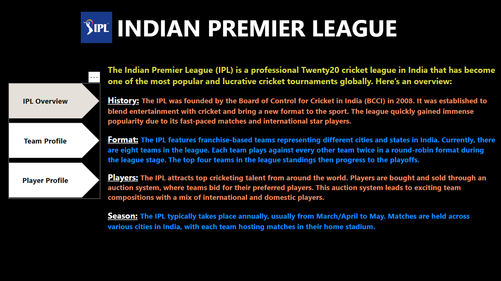
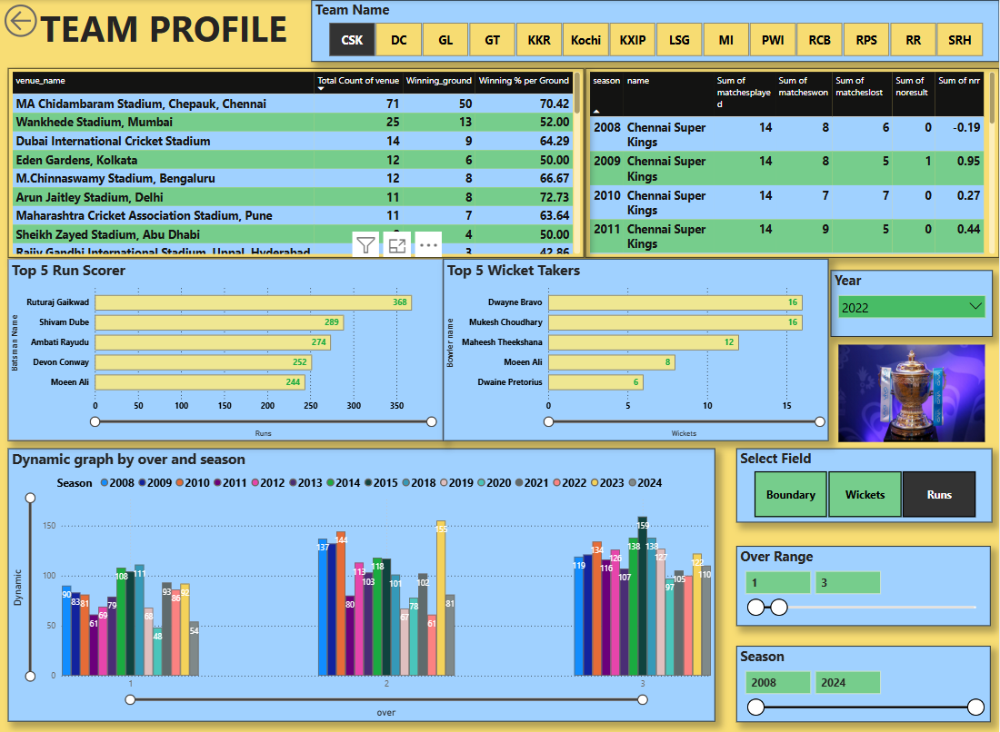
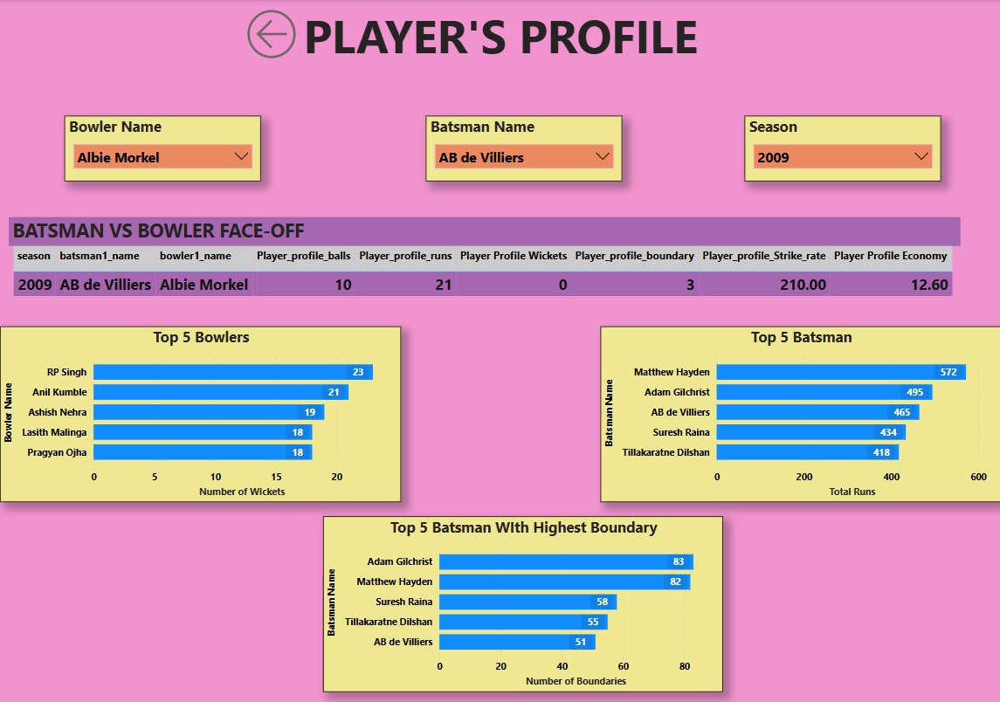
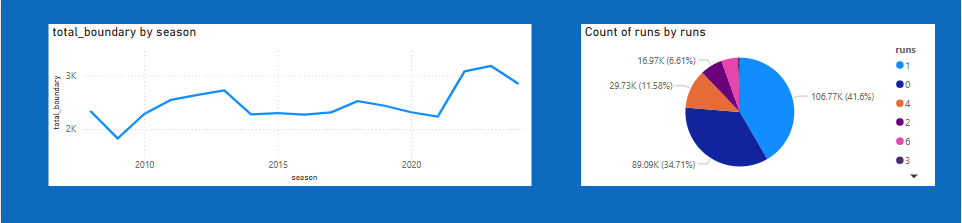

Certainly! Here's a comprehensive `README.md` for your GitHub project, **[IPL-Power-BI](https://github.com/Prayesh13/IPL-Power-BI/tree/master)**:

---

# 🏏 IPL Data Analysis (2008–2024) using Power BI

This project leverages Microsoft Power BI to analyze and visualize Indian Premier League (IPL) cricket data from 2008 to 2024. The interactive dashboards offer insights into match outcomes, player performances, team statistics, and seasonal trends, catering to cricket enthusiasts and data analysts alike.

## 📊 Project Overview

The IPL Data Analysis project provides a comprehensive exploration of IPL cricket data, focusing on:

* **Match Outcomes**: Win/loss records, team performance metrics.
* **Player Statistics**: Runs, wickets, strike rates, and player rankings.
* **Seasonal Trends**: Year-wise performance comparisons and patterns.
* **Venue Analysis**: Insights into match outcomes based on different venues.
* **Key Metrics**: Orange Cap (top run-scorer), Purple Cap (top wicket-taker), and other performance indicators.

## 🔧 Tools & Technologies

* **Microsoft Power BI**: For data visualization and dashboard creation.
* **DAX (Data Analysis Expressions)**: For custom calculations and KPIs.
* **Power Query Editor**: For data transformation and cleaning.
* **Data Sources**: IPL match and player statistics data from 2008 to 2024 get from kaggle.

## 📁 Repository Structure

```
  └──/data
  └── IPL_Dashboard.pbix       # data for analysis
README.md                      # Project documentation
```

## 🚀 Getting Started

### Prerequisites

* [Power BI Desktop](https://powerbi.microsoft.com/desktop/) installed on your machine.

### Steps to Explore the Dashboard

1. **Clone the Repository**:

   ```bash
   git clone https://github.com/Prayesh13/IPL-Power-BI.git
   cd IPL-Power-BI
   ```

2. **Open the Project**:

   Launch Power BI Desktop and open the `IPL_Dashboard.pbix` file located in the repository.

3. **Explore the Dashboards**:

   Navigate through the interactive dashboards to analyze various aspects of the IPL data.

4. **Update Data**:

   To refresh the data, update the dataset within Power BI by connecting to the source or importing new data.

## 📈 Key Features

* **Interactive Filters**: Filter data by season, team, player, and venue.
* **Dynamic Visualizations**: Includes bar charts, line graphs, pie charts, and tables.
* **Custom Calculations**: DAX measures for advanced analytics.
* **User-Friendly Interface**: Clean and intuitive dashboard design for easy navigation.

📷 Dashboard Screenshots
📌 Home page


📌 IPL Overview


📌 Team Profile


📌 Player Profile


📌 Year-wise Trends & Comparison


🔍 Images are located in the /images directory. Replace the placeholder images above with actual screenshots from your Power BI dashboard.


## 🤝 Contributing

Contributions are welcome! If you have suggestions for improvements or additional features, please feel free to fork the repository and submit a pull request.

